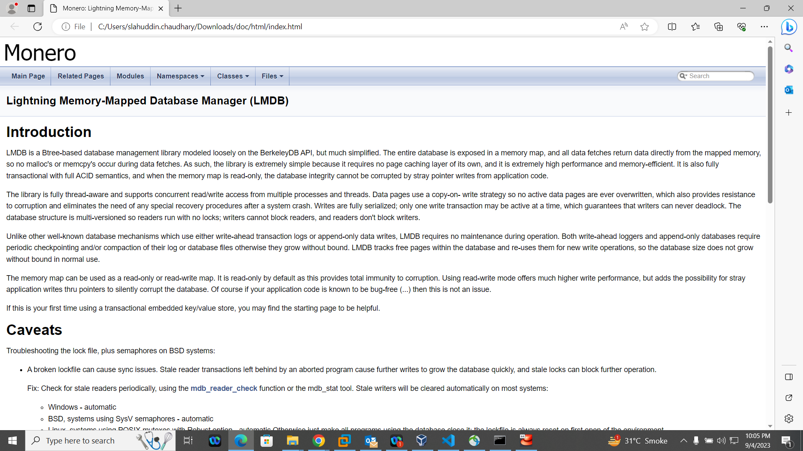
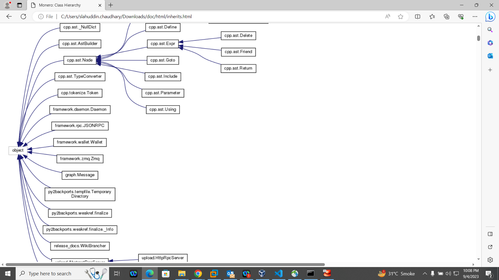
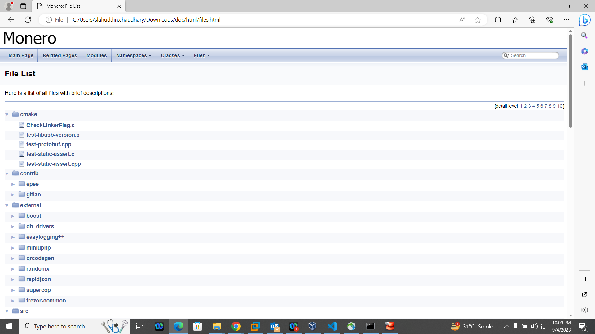
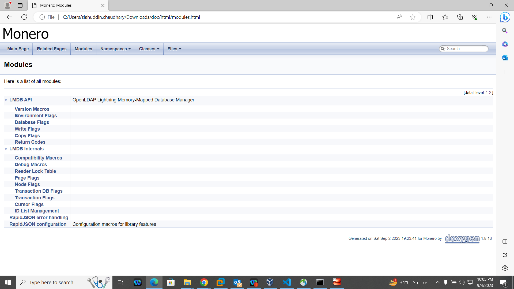

# Monero Doxyfile and Generated Documentation

I have created a `Doxyfile` to facilitate the generation of code documentation for the Monero project. Below are some of the key details and snapshots of the generated documentation.


## Table of Contents
- [Prerequisites](#prerequisites)
- [How to Use](#how-to-use)
- [Snapshots of Generated Documentation](#snapshots-of-generated-documentation)
- [Customizing the Doxyfile](#customizing-the-doxyfile)
- [Contributing](#contributing)

## Prerequisites

- You should have Doxygen installed on your machine. If it's not, you can install it using the package manager. For example, on Ubuntu:

    ```bash
    sudo apt-get install doxygen
    ```
  

## How to Use

1. **Navigate to the Directory Containing the Doxyfile**:
    ```bash
    cd /path/to/directory/containing/Doxyfile
    ```

2. **Generate Documentation**:
    ```bash
    doxygen Doxyfile
    ```
    This will generate the documentation and output it to a directory as specified in the `Doxyfile`. By default, this is usually a directory named `html`.

3. **View Documentation**:
    Open the `index.html` in the generated directory using a web browser to view the documentation.
    ```bash
    xdg-open html/index.html
    ```

## Snapshots of Generated Documentation

Here are some snapshots of the generated documentation:

1. **Index Page**: 

    

2. **Class Hierarchy**:

    

3. **File List**:

    

4. **Other Example Page**:

    

## Customizing the Doxyfile

If you want to customize the settings, open the `Doxyfile` in a text editor and make the necessary changes. For more information on the different settings you can change, see the [Doxygen manual](https://www.doxygen.nl/manual/index.html).

## Contributing

If you find any errors or would like to make improvements, feel free to create an issue or submit a pull request in the Monero GitHub repository.

SLAH UD DIN